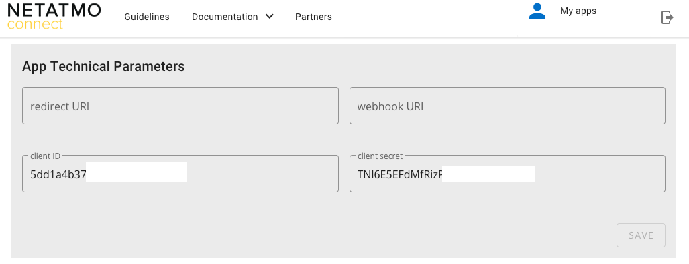
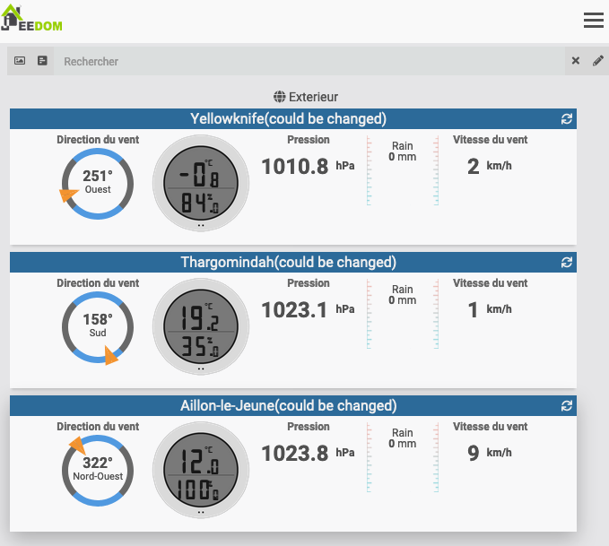
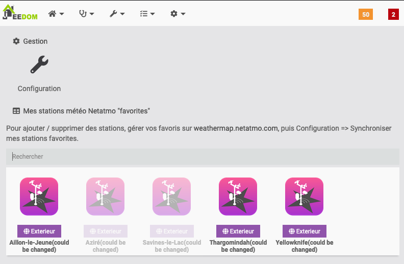
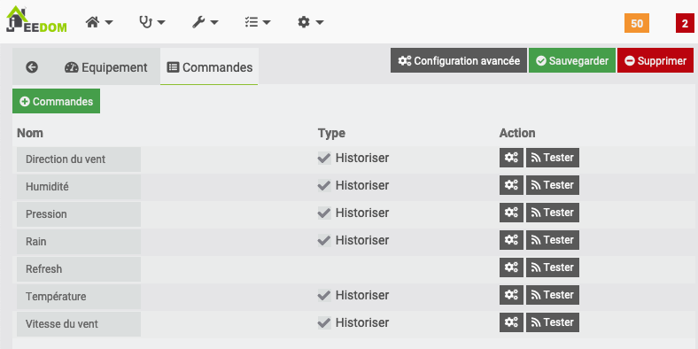

# Description
This plugin retrieve weather reports from Netatmo stations. From favorite weather stations in your (free) Netatmo account. Creation and management on https://weathermap.netatmo.com

# Configuration
Once the plugin is installed, you need to fill in your Netatmo connection information:

- Client ID: your client ID (see configuration section)
- Secret client: your secret client (see configuration section)
- Username: username of your netatmo account
- Password: password for your Netatmo account

Synchronize: allows you to synchronize Jeedom with your Netamo account to automatically discover your "favorite" Netamo stations, to you or to your neighbors. To do after having saved the previous parameters.

### Retrieving connection information
To integrate your Welcome, you must have a `client_id` and a` client_secret` generated on the site http://dev.netatmo.com.

For this you must create your application (free): https://dev.netatmo.com/apps/createanapp#form

# FAQ
- Does the plugin rely on third-party APIs?
> Yes, the plugin uses the Netatmo APIs to retrieve data from your favorite weather stations

- When data is updated ?
> Every 15 minutes, by the Jeon Cron task.

- Where can I manage (add / delete) weather stations?
> Only from https://weathermap.netatmo.com. Once connected, you can put stations in your * favorites *. Start synchronization, and the devices are created (active + visible).

- If I delete a weather station from my favorites, what happens?
> The equipment is * deactivated *, but remains present in Jeedom. You can delete it manually.

# Example

## Dashboard (Widget natif v4)

## Equipments

## Commands

